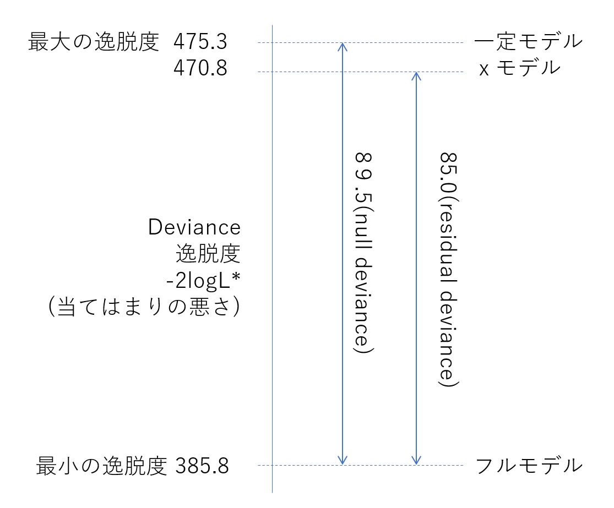

# GLMのモデル選択

複数の統計モデルから、何らかの意味で良いモデルを選ぶことをモデル選択という。  
AICというモデル選択については、「良い予測をするモデルが良いモデルである」という考えに基づいて設計された基準。（当てはまりの良さ、とは異なる）
（最大対数尤度は当てはまりの良さを表す指標）  
AICがどのように予測能力の高いモデルを選べるのかを、定量的に数値実験の例を提示する。

## 逸脱度

「当てはまりの悪さ」である逸脱度の説明。   逸脱度Dとは、あてはまりの良さである最大対数尤度Lを以下のように変形した統計量。  $$ D = -2 \log L $$

通常、フルモデルの逸脱度をこの逸脱度から引いた、残差逸脱度で評価される。  
フルモデルの逸脱度とは、全てのデータ数のパラメータを用意してあてはめたモデルのこと。 
イメージとして、一つの観測データに対して、最適な確率密度関数（この例ではポアソン分布  
における観測値＝平均値）の値を返したものの尤度。

フルモデルは全データを読み上げているだけで、統計モデルとしての価値はない。  
その対数尤度を用いた逸脱度を評価として用いているということ。  

この逸脱度を使った評価では、パラメータの数が多いモデルほど残差逸脱度が小さくなり、あてはまりが良くなる。  


|名前|定義|
|---|---|
|逸脱度($D$)|$-2logL*$|
|最小の逸脱度|フルモデルを当てはめた時のD|
|残差逸脱度|D-最小のD|
|最大の逸脱度|Nullモデルを当てはめた時のD|
|Null逸脱度|最大のD-最小のD|


3.4.1項で扱った平均種子数$\lambda_i$が植物の体サイズ$x_i$だけに依存するモデル

$$ \lambda_i = exp(\beta_1 + \beta_2 x_i)$$

をxモデルとすると、このモデルの最大対数尤度は-235.4程度だったので、逸脱度は470.8になる。  
しかし、glmで当てはめを行うと

```{r, echo=T, message=F, warning=F, fig.width=8, fig.height=5}
library(tidyverse)

data <- read.csv("../kubobook_2012/poisson/data3a.csv")

fit <- glm(y ~ x, data = data, family = poisson) # poissonでポアソン分布を指定
summary(fit)
```

となり、どこにも470.8なる数値は出ない。
その代わり、  

 - Null deviance: 89.507  on 99  degrees of freedom  
 - Residual deviance: 84.993  on 98  degrees of freedom  
 - AIC  
 
といった数値が示されている。


<div align="center">

</div>

```{r, echo=T, message=F, warning=F, fig.width=8, fig.height=5}
# フルモデルの逸脱度
d <- data
sum(log(dpois(d$y, lambda = d$y))) * (-2)
```
フルモデルの逸脱度は`r sum(log(dpois(d$y, lambda = d$y))) * (-2)`となり、
100個の個体分の観測データでポアソン回帰で可能な最小逸脱度となる。  

これで最小の逸脱度が求まっている。  
例えばxモデルの残差逸脱度は、  

$$ D - (最小逸脱度D) = 470.8 - 385.8 = 85.0$$

この値はglm()の出力に示されていた、Residual devianceと一致している。  
残差逸脱度とは。このデータにおいては385.8を基準とする**「当てはまりの悪さの相対値」**となる。

フルモデルとは逆に、最も当てはまりの悪いモデルが、nullモデルで、最もパラメータ数の少ないモデルで、切片$\beta_1$のみのモデル。
  
```{r, echo=T, message=F, warning=F, fig.width=8, fig.height=5}
fit_null <- glm(formula = y ~ 1, family = poisson, data = d)
summary(fit_null)
```

```{r, echo=T, message=F, warning=F, fig.width=8, fig.height=5}
# nullモデルの逸脱度
-2 * as.numeric(logLik(fit_null))
```
逸脱度は`r -2 * as.numeric(logLik(fit_null))`で、最小のDである385.8の差が89.5くらいになる。
パラメータ数が増えれば残差逸脱度はどんどん小さくなり、当てはまりは良くなる。


## モデル選択基準AIC

AICは、kを最尤推定したパラメータ数、logLを最大対数尤度として、

 $$ 平均対数尤度 = (\log L - k) $$

「統計モデルの予測の良さ」を表す平均対数尤度に、-2を掛けたものがAICとなる。
AICは予測の悪さと解釈できる。  


```{r, echo=T, message=F, warning=F, fig.width=8, fig.height=5}

```